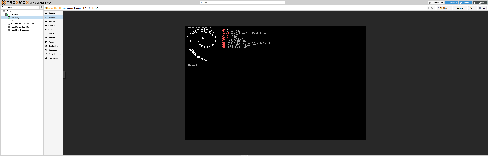
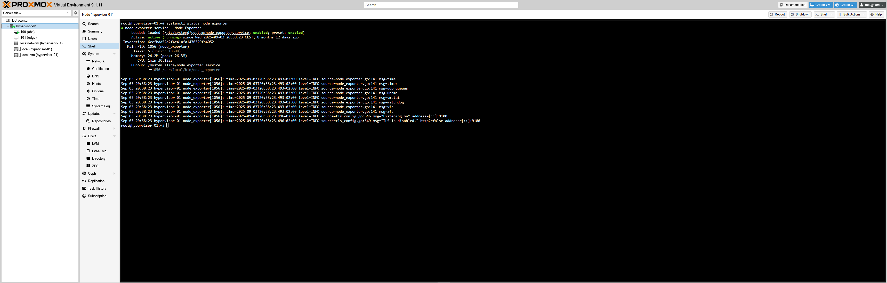
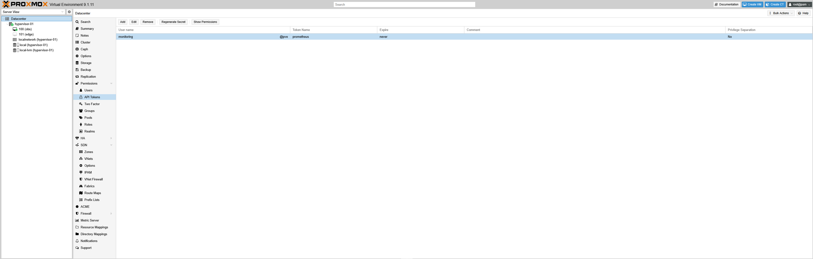
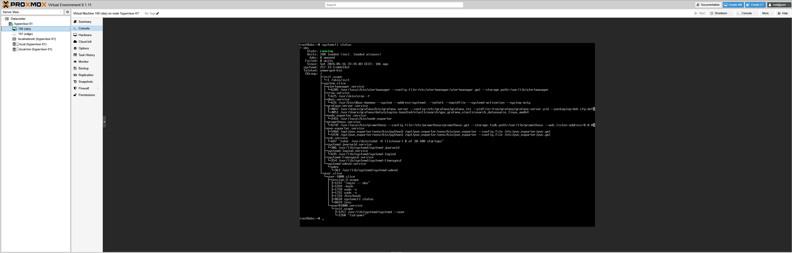
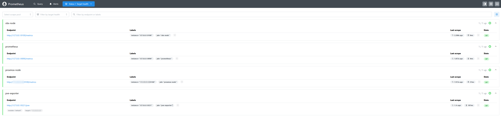
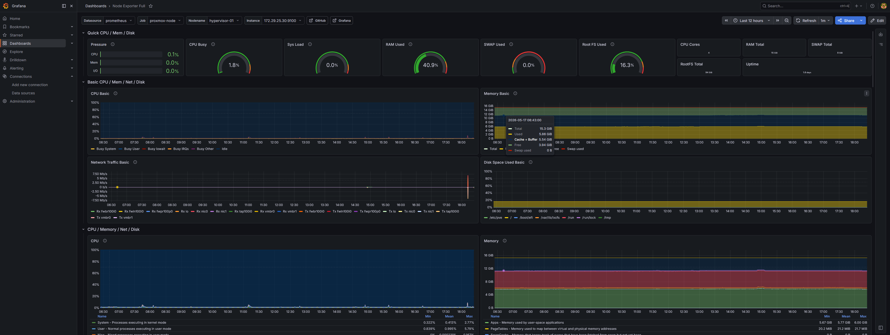

# Runbook — Proxmox Monitoring Stack

## Prometheus · Node Exporter · pve_exporter · Grafana · Alertmanager
### Deployed via Ansible

---

## Overview

This runbook documents the deployment of a reproducible monitoring stack for a Proxmox VE environment.
The stack is based on a dedicated Debian 13 monitoring VM and uses native systemd services.
All commands are validated against the target environment.

---

## Architecture



---

## Stack Versions

| Component     | Version  |
|---------------|----------|
| Proxmox VE    | 9.1      |
| Debian        | 13       |
| Ansible       | latest   |
| Prometheus    | 3.10.0   |
| Node Exporter | 1.10.2   |
| pve_exporter  | latest   |
| Grafana       | latest   |
| Alertmanager  | 0.27.0   |

---

## Prerequisites

### Infrastructure

- One Proxmox VE 9.1 host
- One Debian 13 VM dedicated to monitoring
- Network connectivity between the monitoring VM and the Proxmox host
- Administrative access on both systems

### Monitoring VM — Required packages

```bash
# As root on the monitoring VM
apt update && apt install sudo openssh-server -y
systemctl enable --now ssh
usermod -aG sudo obs
```

### Risk zone — sudo vs doas

Ansible requires `sudo` and uses flags that are incompatible with `doas`.
Do not use `doas` as a substitute. If `doas` is already installed, install `sudo` alongside it.

### Ansible — Passwordless sudo

Ansible cannot handle interactive password prompts. Configure passwordless sudo on the monitoring VM before running any playbook.

```bash
# As root on the monitoring VM
visudo
# Add at the end of the file:
obs ALL=(ALL) NOPASSWD: ALL
```

---

## 1. Ansible Setup

### Install Ansible on Proxmox

```bash
apt update && apt install ansible -y
ansible --version
```

### Generate a dedicated SSH key without passphrase

```bash
ssh-keygen -t ed25519 -C "ansible" -f ~/.ssh/id_ansible
# Press Enter twice — no passphrase
```

### Risk zone — SSH key passphrase

Ansible connects automatically without user interaction.
A passphrase on the SSH key will cause all connections to fail with `Permission denied (publickey)`.
Always generate a dedicated key without passphrase for Ansible.

### Copy the key to the monitoring VM

```bash
ssh-copy-id -i ~/.ssh/id_ansible.pub obs@<OBS_IP>
```

### Test the connection

```bash
ssh -i ~/.ssh/id_ansible obs@<OBS_IP>
exit
```

### Create the project structure

```bash
mkdir ~/ansible-lab && cd ~/ansible-lab
nano inventory.ini
```

```ini
[monitoring]
obs ansible_host=<OBS_IP> ansible_user=obs ansible_become=true ansible_become_method=sudo ansible_ssh_private_key_file=~/.ssh/id_ansible
```

### Validate connectivity

```bash
ansible monitoring -i inventory.ini -m ping
```

Expected output:

```
obs | SUCCESS => {
    "ping": "pong"
}
```

---

## 2. Deploy the Monitoring Stack

```bash
ansible-playbook -i inventory.ini deploy_monitoring.yml
```

Expected output:

```
PLAY RECAP
obs : ok=20  changed=19  unreachable=0  failed=0  skipped=0
```

### Risk zone — YAML indentation in prometheus.yml

The Ansible playbook deploys a `prometheus.yml` configuration file inline.
YAML is indentation-sensitive. Any misalignment will cause Prometheus to fail at startup with `exit-code 2`.

Always validate the configuration after any manual edit:

```bash
promtool check config /etc/prometheus/prometheus.yml
```

---

## 3. Node Exporter on Proxmox

The Proxmox host must expose host-level metrics on port 9100.
Run the following commands directly on the Proxmox host.

```bash
cd /tmp
wget https://github.com/prometheus/node_exporter/releases/download/v1.10.2/node_exporter-1.10.2.linux-amd64.tar.gz
tar -xzf node_exporter-1.10.2.linux-amd64.tar.gz
install -m 0755 node_exporter-1.10.2.linux-amd64/node_exporter /usr/local/bin/
useradd --system --no-create-home --shell /usr/sbin/nologin node_exporter
```

Create the service file:

```bash
nano /etc/systemd/system/node_exporter.service
```

```ini
[Unit]
Description=Node Exporter
Wants=network-online.target
After=network-online.target

[Service]
User=node_exporter
Group=node_exporter
Type=simple
ExecStart=/usr/local/bin/node_exporter
Restart=on-failure
RestartSec=5s
NoNewPrivileges=true
ProtectSystem=full
ProtectHome=true
PrivateTmp=true

[Install]
WantedBy=multi-user.target
```

```bash
systemctl daemon-reload
systemctl enable --now node_exporter
systemctl status node_exporter
```



---

## 4. Proxmox API User and Token

Run the following commands on the Proxmox host.

```bash
pveum user add monitoring@pve
pveum aclmod / -user monitoring@pve -role PVEAuditor
pveum user token add monitoring@pve prometheus --privsep 0
```



### Risk zone — Token value

The token value is displayed only once at creation time.
Copy it immediately and store it securely.
If lost, delete and recreate the token:

```bash
pveum user token remove monitoring@pve prometheus
pveum user token add monitoring@pve prometheus --privsep 0
```

---

## 5. pve_exporter Installation

### Install on the monitoring VM

```bash
sudo apt install python3 python3-venv -y
sudo useradd --system --home-dir /opt/pve_exporter --create-home --shell /usr/sbin/nologin pve_exporter
sudo python3 -m venv /opt/pve_exporter/venv
sudo /opt/pve_exporter/venv/bin/pip install --upgrade pip
sudo /opt/pve_exporter/venv/bin/pip install prometheus-pve-exporter
```

### Create the configuration file

```bash
sudo mkdir -p /etc/pve_exporter
sudo nano /etc/pve_exporter/pve.yml
```

```yaml
default:
  user: monitoring@pve
  token_name: prometheus
  token_value: <TOKEN_VALUE>
  verify_ssl: false
```

```bash
sudo chown root:pve_exporter /etc/pve_exporter/pve.yml
sudo chmod 640 /etc/pve_exporter/pve.yml
```

### Create the service

```bash
sudo nano /etc/systemd/system/pve-exporter.service
```

```ini
[Unit]
Description=Prometheus Proxmox VE Exporter
Wants=network-online.target
After=network-online.target

[Service]
User=pve_exporter
Group=pve_exporter
Type=simple
ExecStart=/opt/pve_exporter/venv/bin/pve_exporter --config.file /etc/pve_exporter/pve.yml
Restart=on-failure
RestartSec=5s
NoNewPrivileges=true
ProtectSystem=full
ProtectHome=true
PrivateTmp=true
ReadWritePaths=/opt/pve_exporter
WorkingDirectory=/opt/pve_exporter

[Install]
WantedBy=multi-user.target
```

### Risk zone — ProtectSystem=strict

Using `ProtectSystem=strict` prevents pve_exporter from writing its `.gunicorn` runtime file under `/opt/pve_exporter`.
The service will start but log a `Read-only file system` error.
Use `ProtectSystem=full` combined with `ReadWritePaths=/opt/pve_exporter`.

```bash
sudo systemctl daemon-reload
sudo systemctl enable --now pve-exporter
sudo systemctl status pve-exporter
```

### Validate locally

```bash
curl "http://127.0.0.1:9221/pve?target=<PROXMOX_IP>&module=default" | grep "^pve_up"
```

Expected output:

```
pve_up{id="node/hypervisor-01"} 1.0
pve_up{id="qemu/100"} 1.0
```

---

## 6. Prometheus Configuration

### Risk zone — pve_exporter scrape configuration

pve_exporter version 3.x exposes Proxmox metrics on `/pve?target=...&module=...` rather than the standard `/metrics` endpoint.
Prometheus must be configured with the correct `metrics_path` and `params` to collect these metrics.

Final `prometheus.yml`:

```yaml
global:
  scrape_interval: 15s
  evaluation_interval: 15s

alerting:
  alertmanagers:
    - static_configs:
        - targets:
            - 127.0.0.1:9093

rule_files: []

scrape_configs:
  - job_name: prometheus
    static_configs:
      - targets:
          - 127.0.0.1:9090

  - job_name: proxmox-node
    static_configs:
      - targets:
          - <PROXMOX_IP>:9100

  - job_name: obs-node
    static_configs:
      - targets:
          - 127.0.0.1:9100

  - job_name: pve-exporter
    metrics_path: /pve
    params:
      module: [default]
      target: [<PROXMOX_IP>]
    static_configs:
      - targets:
          - 127.0.0.1:9221
```

Validate and restart:

```bash
promtool check config /etc/prometheus/prometheus.yml
sudo systemctl restart prometheus
```

---

## 7. Alertmanager Installation

```bash
cd /tmp
wget https://github.com/prometheus/alertmanager/releases/download/v0.27.0/alertmanager-0.27.0.linux-amd64.tar.gz
tar -xzf alertmanager-0.27.0.linux-amd64.tar.gz
sudo install -m 0755 alertmanager-0.27.0.linux-amd64/alertmanager /usr/local/bin/
sudo install -m 0755 alertmanager-0.27.0.linux-amd64/amtool /usr/local/bin/

sudo useradd --system --no-create-home --shell /usr/sbin/nologin alertmanager
sudo mkdir -p /etc/alertmanager /var/lib/alertmanager
sudo chown alertmanager:alertmanager /etc/alertmanager /var/lib/alertmanager

sudo nano /etc/alertmanager/alertmanager.yml
```

```yaml
global:
  resolve_timeout: 5m

route:
  group_by: ['alertname']
  group_wait: 10s
  group_interval: 10s
  repeat_interval: 1h
  receiver: 'default'

receivers:
  - name: 'default'

inhibit_rules: []
```

```bash
sudo nano /etc/systemd/system/alertmanager.service
```

```ini
[Unit]
Description=Alertmanager
Wants=network-online.target
After=network-online.target

[Service]
User=alertmanager
Group=alertmanager
Type=simple
ExecStart=/usr/local/bin/alertmanager \
  --config.file=/etc/alertmanager/alertmanager.yml \
  --storage.path=/var/lib/alertmanager
Restart=on-failure
RestartSec=5s

[Install]
WantedBy=multi-user.target
```

```bash
sudo systemctl daemon-reload
sudo systemctl enable --now alertmanager
sudo systemctl status alertmanager
```

---

## 8. Validation

### Service health checks

```bash
# Prometheus
curl http://<OBS_IP>:9090/-/healthy

# Node Exporter — monitoring VM
curl http://<OBS_IP>:9100/metrics | head -3

# Node Exporter — Proxmox host
curl http://<PROXMOX_IP>:9100/metrics | head -3

# pve_exporter
curl "http://<OBS_IP>:9221/pve?target=<PROXMOX_IP>&module=default" | grep pve_up

# Alertmanager
curl http://<OBS_IP>:9093/-/healthy
```



### Prometheus targets

```
http://<OBS_IP>:9090/targets
```

All four targets must show state UP:

| Job | Target | Expected state |
|---|---|---|
| prometheus | 127.0.0.1:9090 | UP |
| proxmox-node | PROXMOX_IP:9100 | UP |
| obs-node | 127.0.0.1:9100 | UP |
| pve-exporter | 127.0.0.1:9221 | UP |



### Grafana

```
http://<OBS_IP>:3000
```

Default credentials: `admin` / `admin`

Add Prometheus as data source:
- URL: `http://127.0.0.1:9090`
- Save and test

Import dashboards:
- ID `1860` — Node Exporter Full
- ID `10347` — Proxmox via Prometheus



---

## 9. Known Issues and Fixes

| Issue | Root cause | Fix |
|---|---|---|
| SSH Permission denied (publickey) | SSH key generated with passphrase | Generate a dedicated key without passphrase |
| Missing sudo password | sudo requires interactive password | Add `obs ALL=(ALL) NOPASSWD: ALL` in visudo |
| doas: invalid option | doas incompatible with Ansible sudo flags | Install sudo, do not use doas |
| Prometheus exit-code 2 | YAML syntax error in prometheus.yml | Validate with `promtool check config` before restart |
| YAML parsing error line N | Incorrect indentation in scrape_configs | Ensure all jobs are indented under `scrape_configs` |
| pve-exporter Read-only file system | ProtectSystem=strict blocks write to /opt/pve_exporter | Use ProtectSystem=full with ReadWritePaths=/opt/pve_exporter |
| pve_* metrics not found in Prometheus | pve_exporter 3.x uses /pve endpoint, not /metrics | Add metrics_path and params to the pve-exporter job |

---

## 10. Next Steps

- Configure Alertmanager notification receivers (email, Slack, Telegram)
- Define Prometheus alerting rules
- Deploy Node Exporter on additional VMs
- Add nftables firewall rules
- Implement Git-based configuration management

---

*Runbook v1.0 — May 2026*  
*Author: Olsen CAVALLERO — Systems, Network and Security Administrator*  
*Environment: Proxmox VE 9.1 — Debian 13 — Ansible*
